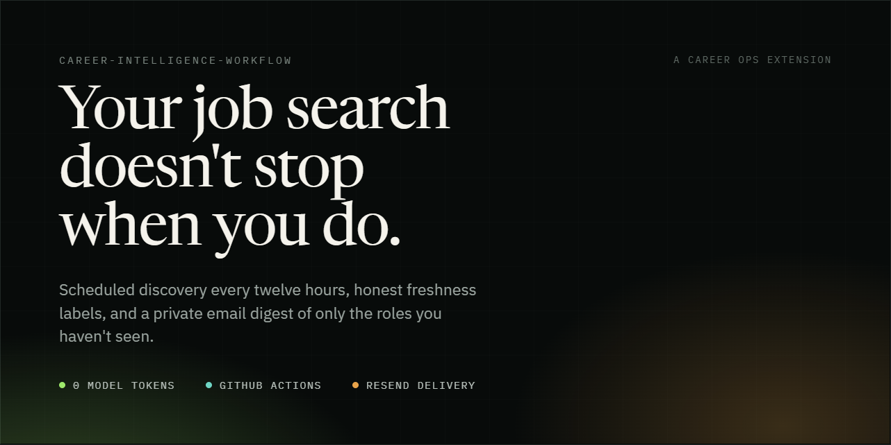
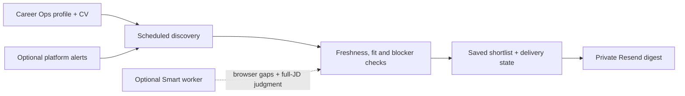
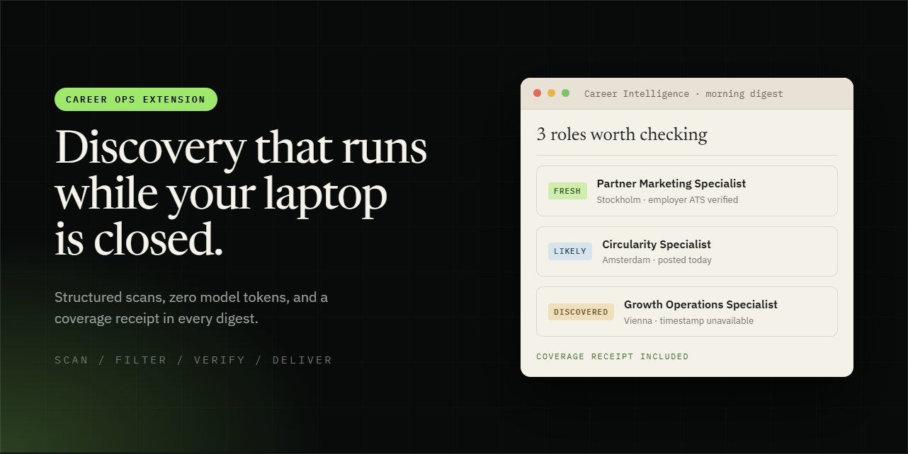
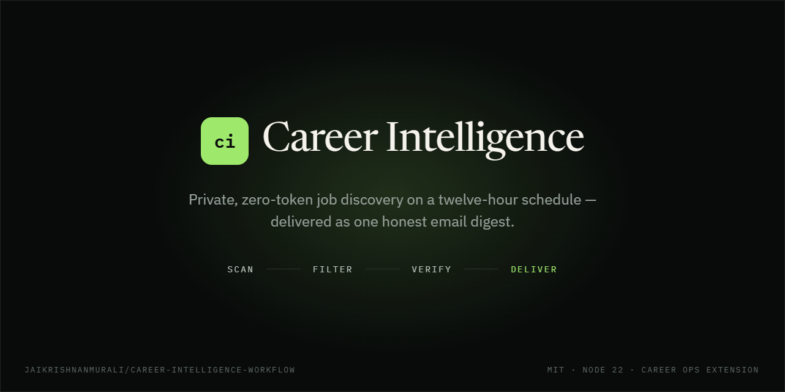

<h1 align="center">Career Intelligence Workflow</h1>

<p align="center">
  <strong>Your job search should not stop when you close your laptop.</strong><br>
  The scheduled discovery and private email layer for <a href="https://github.com/santifer/career-ops">Career Ops</a>.
</p>

<p align="center">
  
</p>

<p align="center">
  <a href="#discovery-or-smart"></a>
  <a href="#what-zero-token-discovery-can-see"></a>
  <a href="#project-boundaries"></a>
</p>

<p align="center">
  
  
  
  
  
  
</p>

<p align="center"><em>Created by Jai Krishnan Murali from a private Career Ops workflow developed for his own job search, then redesigned as a reusable open-source system with Codex assistance.</em></p>

---

Career Intelligence runs in GitHub Actions, remembers what it has already seen, and emails only new jobs that survive your role, location, language, seniority and work-authorization rules.

## Why I built it

I wanted Career Ops to keep searching after I closed the local session. The first version ran every twelve hours and emailed fresh jobs, but an audit exposed a serious problem: the cloud rewrite had drifted away from the Career Ops scanner and replaced parts of it with a smaller custom search. That made the automation cheaper, but also easier to miss useful roles.

The redesign starts from a stricter rule: **Career Ops remains the career system and search specification.** Career Intelligence owns the unattended schedule, extra structured sources, freshness checks, durable state and email delivery around it.

The public project grew out of that private workflow. It is designed for other job seekers to configure with their own CV, target roles and boundaries—not as a copy of my personal search.

## What this project adds to Career Ops

Career Ops already provides the profile, CV, search rules and application workflow. Career Intelligence keeps that foundation and adds one focused layer around it:

- scheduled searches while your computer is off;
- a structured zero-model-token discovery mode;
- an optional deeper Codex or Claude Code mode;
- freshness, duplicate and hard-language checks;
- private email delivery through Resend;
- durable history, retry protection and coverage receipts.

It finds and recommends jobs. It does not apply, contact employers, tailor your CV or replace Career Ops.



## At a glance

| Feature | What it means for the user |
|---|---|
| **Twice-daily discovery** | Morning and evening delivery windows continue while the user's computer is off. |
| **Career Ops foundation** | The existing CV, profile, portals, history and shortlist remain the source of truth. |
| **Honest freshness** | Exact timestamps, “posted today” signals and newly discovered untimestamped jobs are labelled differently. |
| **Coverage receipts** | Completed, partial, failed and unconfigured sources remain visible in every run. |
| **Delivery protection** | Durable outbox state, staggered retries and one stable delivery key prevent accidental duplicates. |
| **Eight alert routes** | LinkedIn and seven other platforms can add leads through narrow email forwarding, without signed-in scraping. |
| **Optional Smart layer** | Codex or Claude Code can search browser gaps and judge a bounded set of full job descriptions. |

## Start with the route that matches you

### I only use ChatGPT or Claude in a browser

You can set up Discovery Digest without learning VS Code, installing a coding agent or buying an AI plan.

<p align="center">
  <a href="https://codespaces.new/jaikrishnanmurali/career-intelligence-workflow?quickstart=1&amp;devcontainer_path=.devcontainer%2Fdevcontainer.json"></a>
</p>

GitHub opens a private Codespace and then the setup page. The page takes you through eight short stages:

1. Confirm that the free Discovery route matches what you want.
2. Add your CV and the basic facts Career Ops needs.
3. Review the roles, nearby titles, responsibilities, locations and hard-language blockers the search will use.
4. See exactly what zero-token discovery can and cannot cover.
5. Create a private Career Ops repository through GitHub's browser sign-in.
6. Connect Resend without putting the key in an AI chat or tracked file.
7. Run a safety check and a no-email scan.
8. Activate the schedule only after both checks pass.

The browser route installs the validated Career Ops foundation for you. Your CV is processed inside your private GitHub Codespace and is not sent to OpenAI or Anthropic. Smart Digest stays off.

You need a desktop or laptop browser, a GitHub account, your CV and a Resend account. [No custom email domain is required](https://resend.com/docs/knowledge-base/403-error-resend-dev-domain) when the test digest goes to the email address on your Resend account. [Personal GitHub accounts include monthly Codespaces usage](https://docs.github.com/en/codespaces/about-codespaces/what-are-codespaces), but Codespaces, GitHub Actions and Resend still have account quotas. “Zero model tokens” does not mean unlimited infrastructure.

Read [Browser Setup](docs/BROWSER_SETUP.md) for privacy details, recovery steps and the exact free-mode limits.

### I already use Codex or Claude Code

Install and onboard Career Ops first:

```powershell
npx @santifer/career-ops init
cd career-ops
```

Open Codex or Claude Code from that folder and finish the Career Ops profile and CV onboarding. Then, from the Career Ops root, install this extension:

```powershell
npx --yes github:jaikrishnanmurali/career-intelligence-workflow setup
```

Tell the agent:

```text
Set up my zero-token 12-hour Discovery Digest.
```

The agent follows the repository's eight-stage onboarding contract. It checks the workspace, drafts the search map from Career Ops, explains every cloud pipeline, guides GitHub and Resend sign-in, tests without emailing, and asks separately before enabling the schedule.

Already use another Career Ops agent? You can keep it. This project's guided cloud setup currently supports Codex and Claude Code; Career Ops itself supports more agents.

## What happens every morning and evening

<p align="center">
  
</p>

Each delivery window has three staggered attempts. They are retries for one logical slot, not three separate scans.

On a normal run, Career Intelligence:

1. restores the latest Career Ops history and delivery state;
2. runs the official Career Ops structured scanner;
3. checks supplemental public feeds and a rotating group of employer ATS boards;
4. normalizes and deduplicates the listings;
5. applies the reviewed role, location, language, seniority and authorization rules;
6. verifies a bounded shortlist against the live job pages;
7. saves the exact email payload before contacting Resend;
8. sends only when at least one new recommendation survives.

A run with no recommendations is still a successful run. It records the result, sends no empty email and stops the remaining retries for that slot.

If delivery fails after the message is prepared, the next attempt reuses the saved message instead of scanning again. Every attempt uses the same repository-scoped delivery key, and a delivered slot cannot be forced to send twice.

## Discovery or Smart?

Discovery Digest is the default because it is predictable, inexpensive and easy to run privately. Smart Digest is an optional coverage and judgment layer.

| | Discovery Digest | Smart Digest |
|---|---|---|
| Public feeds and structured ATS endpoints | Yes | Yes |
| Official Career Ops structured scan | Yes | Yes |
| Deterministic filtering and ranking | Yes | Yes |
| Model tokens for discovery | 0 | Bounded usage |
| Adaptive browser and broad web-search gaps | Not run | Attempted |
| Full-description model evaluation | No | Bounded batch |
| OpenAI or Anthropic cloud context sharing | No | Yes |
| Provider authentication required | No | Yes |

Smart Digest uses an isolated Codex or Claude Code worker to search gaps and evaluate a bounded set of complete job descriptions. The worker receives no Resend key and no persisted Git credentials. Structured discovery still runs when the Smart worker is disabled or fails.

Before enabling Smart, the guided setup explains what private context reaches the provider, the usage limits and the likely cost. A ChatGPT or Claude website subscription is not silently treated as GitHub Actions API access.

See [Digest modes](docs/DIGEST_MODES.md) and [Agent integrations](docs/AGENT_INTEGRATIONS.md).

## What zero-token discovery can see

Discovery Digest is a real search, but it is not an invisible browser visiting every job site.

It currently checks:

- Platsbanken JobStream;
- Arbeitnow;
- The Hub;
- Welcome to the Jungle;
- Jobicy;
- Himalayas;
- Remotive;
- Remote OK;
- rotating Greenhouse, Lever, Ashby and Workday company boards.

That distinction matters in practice:

- A new Greenhouse vacancy on a company board reached during this run can be found.
- A role visible only in LinkedIn search may be missed unless a configured alert supplies the lead.
- An Indeed or Glassdoor result may still be found when the same role appears on the employer's ATS.
- A JavaScript-heavy careers page with a **Load more** button may be missed without the Smart browser layer.
- A supported ATS company may be missed in one run because large directories are checked in rotating groups, not all at once.

The rotation is deliberate: each run stays bounded, saves its cursor and continues through other boards later. Boards that produced useful jobs can be prioritized.

Every digest says which lanes completed, were partial, failed or were not configured. A source failure is never rewritten as “zero jobs found.” Smart Digest improves coverage, but no mode can guarantee that it found every vacancy on the internet.

### How freshness is described

Career Intelligence keeps three different signals separate:

- **Verified fresh:** the source provides an exact timestamp inside the lookback window.
- **Likely fresh:** the source says something current, such as “Posted Today,” and the URL has not appeared before.
- **Newly discovered:** no reliable posting time is available, but the saved history has never seen the URL.

An untimestamped job is considered once. It is not repeatedly emailed or described as proven to be twelve hours old. Expired pages, already delivered URLs and explicit hard blockers are suppressed.

## Adding the eight broader platform sources

The project can ingest job-alert emails from:

- LinkedIn;
- Indeed;
- Glassdoor;
- Jobbsafari;
- IamExpat;
- karriere.at;
- Climatebase;
- Wellfound.

These are alert routes, not signed-in scraping. The user creates a native alert and a narrow inbox forwarding rule. Resend receives the forwarded alert, and Career Intelligence extracts the job link and minimal provenance. It does not save the raw subject, body, attachment or sender address to GitHub state.

An alert is only a lead. Career Intelligence tries to resolve it to a complete, live employer or ATS page. If that fails, the job appears once as a manual check; it is not presented as a scored recommendation.

Each platform remains **not configured** until an actual forwarded alert is recognized. Follow [Platform alerts](docs/PLATFORM_ALERTS.md) one source at a time.

## Privacy and ownership

The public repository contains the reusable workflow, examples and setup code. Your personal deployment belongs in a separate private repository.

That private repository may contain your Career Ops profile, CV, search rules and history. Email credentials belong only in GitHub Actions Secrets. Runtime state is written to a dedicated private state branch using an explicit file allowlist.

Discovery does not send your CV to an AI provider. Smart Digest sends only the bounded profile and job context needed by the selected OpenAI or Anthropic worker after explicit consent.

If a credential is ever pasted into a chat, issue or commit, replace it and revoke the old one. Deleting the visible text does not invalidate the credential or remove it from history.

Read [Privacy](docs/PRIVACY.md), [Resend setup](docs/RESEND.md) and [Security](SECURITY.md) before deploying personal data.

## Reliability and maintenance

- GitHub Actions keeps the workflow running while your computer is off.
- Local delivery times remain stable through daylight-saving changes.
- A private state branch preserves shortlist, scan history and delivery state across runners.
- One shared workflow lock prevents two state-writing jobs from overwriting each other.
- A weekly compatibility workflow checks for Career Ops and extension updates.
- Updates open a private issue for review; they are not applied automatically.
- A hired outcome can pause the digest, and the workflow supports pause, resume and snooze controls.

The Browser Setup pins `career-ops-v1.23.0`, which matches this release's validated Career Ops 1.22.x–1.24.x data contract. A later compatibility change must pass validation before it replaces that pin.

## Project structure

```text
career-intelligence-workflow/
├── .devcontainer/          # Opens the guided setup in GitHub Codespaces
├── browser-setup/          # Eight-stage browser UI and private setup service
├── config/                 # Example search profile and source packs
├── docs/                   # Setup, privacy, modes and troubleshooting
├── examples/               # GitHub Actions workflow templates
├── integrations/           # Career Ops skill integration
├── modes/                  # Agent instructions for onboarding and Smart runs
├── schemas/                # Strict agent handoff contracts
├── scripts/                # Setup, scanning, state and maintenance commands
├── src/                    # Discovery, ranking, coverage and delivery logic
└── tests/                  # Contract, privacy, scheduling and workflow tests
```

In a personal deployment, this project lives at `career-ops/extensions/career-intelligence-workflow/`. The surrounding private Career Ops repository remains the canonical workspace.

## Useful commands

Run these from `extensions/career-intelligence-workflow` inside the private Career Ops repository:

```powershell
npm run doctor
npm run smoke
npm run scan:structured
npm run status
npm run pause
npm run resume
```

`scan:structured` performs live discovery without sending email. The GitHub workflow remains the supported route for scheduled state restoration, durable retries and delivery.

## Project boundaries

The first public version supports one person per private deployment. It is not a shared coach dashboard or multi-candidate service.

Career Intelligence can discover, filter and recommend jobs. It does not submit applications, fill forms, contact employers, tailor CVs or change the Career Ops application tracker. The browser-only route provides Discovery Digest; Codex or Claude Code is required for the guided Smart setup.

AI assisted the project's development and documentation. The zero-token claim applies only to structured Discovery. Smart Digest intentionally uses bounded model calls.

## FAQ

<details>
<summary><strong>Is this a replacement for Career Ops?</strong></summary>

No. Career Ops supplies the candidate profile, CV, portals, search instructions, shortlist and application workflow. Career Intelligence adds unattended discovery, cloud state and email delivery around it.

</details>

<details>
<summary><strong>Can I use it without a paid ChatGPT or Claude plan?</strong></summary>

Yes, for Discovery Digest. The guided browser route uses deterministic structured discovery and zero model tokens. GitHub Codespaces, Actions and Resend still have their own usage limits. Smart Digest needs separate Codex or Claude Code cloud authentication and may cost money.

</details>

<details>
<summary><strong>Does it scan LinkedIn directly?</strong></summary>

No. Discovery Digest does not sign in to or crawl LinkedIn. A narrow forwarded LinkedIn job alert can add a lead, which the workflow then tries to resolve to a live employer or ATS page. Smart Digest may find some LinkedIn-visible roles through broader web search, but it cannot guarantee complete platform coverage.

</details>

<details>
<summary><strong>Why keep jobs without an exact posting time?</strong></summary>

Some useful employer pages provide no timestamp. A URL that has never appeared in saved history is considered once as **newly discovered**, clearly separated from proven twelve-hour freshness. It is not repeatedly emailed.

</details>

<details>
<summary><strong>Will it apply to jobs for me?</strong></summary>

No. It prepares a recommendation digest. You review the role and decide whether to continue through Career Ops. It never submits an application or contacts an employer.

</details>

## About the project

<p align="center">
  
</p>

Jai Krishnan Murali created Career Intelligence from the Career Ops workflow he used for his own job search. The public version was rebuilt as a reusable, privacy-conscious extension with Codex assistance and is maintained mainly by Jai.

There are no invented success metrics in this README. The project is documented through its behavior, tests and explicit limitations; personal employment outcomes are not presented as product evidence.

## Disclaimer

You control the private repository, provider accounts and job-search data used by your deployment. Review every recommendation and follow the terms of the job platforms and email services you connect. Source coverage can change, websites can fail, and neither deterministic rules nor AI evaluation can guarantee a complete or correct result.

This software is provided under the MIT License without warranty. It does not provide employment, legal or immigration advice.

## Documentation

- [Browser Setup](docs/BROWSER_SETUP.md)
- [Full setup guide](docs/SETUP.md)
- [Digest modes and coverage](docs/DIGEST_MODES.md)
- [Automation and retry design](docs/AUTOMATION.md)
- [Career Ops integration](docs/CAREER_OPS_INTEGRATION.md)
- [Platform alerts](docs/PLATFORM_ALERTS.md)
- [Resend](docs/RESEND.md)
- [Privacy](docs/PRIVACY.md)
- [Troubleshooting](docs/TROUBLESHOOTING.md)
- [Architecture](docs/architecture.md)

MIT licensed. Maintained mainly by Jai Krishnan Murali.
