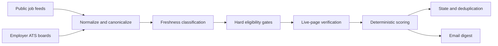

# Career Intelligence Workflow

A configurable, zero-token job-discovery workflow that scans public feeds and
employer ATS boards, validates and ranks vacancies, preserves search history,
and emails a twice-daily digest.

Designed by **Jai Krishnan Murali** and developed with Codex assistance.

> This is a sanitized public reference implementation. The live production
> deployment, search history, email settings, and candidate profile remain
> private.

## What this project demonstrates

- Turning a broad search problem into explicit operating rules
- Combining independent discovery sources without relying on one job board
- Separating timestamp evidence from “new to my records”
- Applying hard language, location, authorization, and expiry gates
- Ranking and deduplicating results with deterministic logic
- Treating false positives as test cases and improving the workflow
- Running a stateful email workflow through GitHub Actions and Resend

The first private cloud deployment screened **20,843 normalized postings in
67 seconds**, produced a two-role review set, and used **zero model tokens**. A
manual audit caught a mandatory-language false positive; the resulting
verification change is included in this public version.

## How it works



The discovery layer currently includes direct-feed lanes and rolling public
company directories for Greenhouse, Lever, Ashby, and Workday. Source failures
are isolated so one unavailable provider does not end the whole scan.

See [the architecture note](docs/architecture.md) for the processing sequence,
freshness model, and public/private boundary.

## Why zero-token

No language model is called during a scheduled scan. Role matching, freshness,
eligibility, ranking, and deduplication are deterministic. That keeps runtime
cost predictable and makes each recommendation traceable to visible rules.

AI assisted the development process, but it is not hidden inside the production
decision path.

## Run locally

Requirements:

- Node.js 22 or newer
- Internet access to the configured public sources

```bash
npm test
npm run smoke
```

`npm run smoke` uses a small source budget, writes a local preview, and does not
send an email.

For email delivery, copy `.env.example` to `.env`, add a Resend key and verified
sender, then run:

```bash
npm run scan -- --send
```

Never commit the `.env` file.

## Configure the search

The public example profile lives in [`src/config.mjs`](src/config.mjs). Adapt:

- `ROLE_FAMILIES` for titles and responsibility signals;
- `LOCATION_GROUPS` for geographic priority;
- `TITLE_EXCLUDES` for hard title exclusions;
- `UNSUPPORTED_LOCAL_LANGUAGES` for mandatory-language gates;
- the environment variables in `.env.example` for scan limits.

Keep a real candidate profile and private career constraints in a private fork.

## GitHub Actions

The included workflow is intentionally manual and bounded. It runs tests first
and defaults to a dry run.

For a real twice-daily deployment:

1. Create a **private fork or private repository**.
2. Copy `examples/deep-job-scan.scheduled.yml` to
   `.github/workflows/deep-job-scan.yml`.
3. Add `RESEND_API_KEY`, `CAREER_DIGEST_FROM`, and `CAREER_DIGEST_TO` as Actions
   secrets.
4. Review the schedule, limits, profile, and source terms.

The scheduled example commits generated state and recommendations. Do not
enable it in a public repository.

## Repository safety

Real state, reports, previews, environment files, and email settings are
excluded. The included JSON files contain only empty or fictional examples.
Read [SECURITY.md](SECURITY.md) before deploying a fork.

## Responsible use

Public job sources can change, throttle requests, or impose their own terms.
Use conservative limits, respect provider policies and rate limits, and prefer
official employer pages for final verification. This project assists discovery;
it does not submit applications or make employment decisions.

## Licence

The project code is available under the [MIT License](LICENSE). Third-party job
data and services remain subject to their respective terms.

