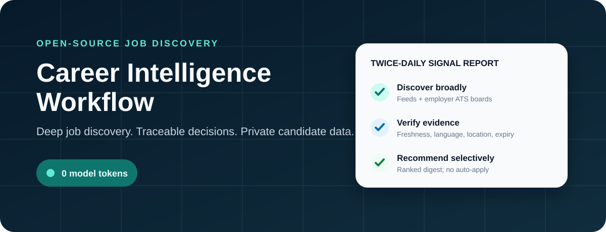
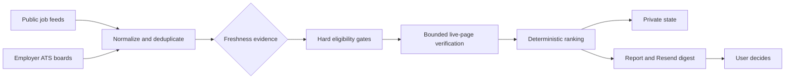

<p align="center">
  
</p>

<p align="center">
  <a href="https://github.com/jaikrishnanmurali/career-intelligence-workflow/actions"></a>
  
  
  
  <a href="LICENSE"></a>
</p>

# Career Intelligence Workflow

A configurable job-discovery system that searches public feeds and employer ATS boards, checks freshness and hard blockers, ranks the surviving roles, remembers what it has already seen, and emails a focused digest through Resend.

The scheduled scanner uses deterministic rules and **zero model API tokens**. Candidate profiles, email addresses, scan state, and recommendations stay in the user's private deployment.

**Created by Jai Krishnan Murali from a private Career Ops workflow developed for his own job search, then redesigned as a reusable open-source system with Codex assistance.**

## Why this exists

A job alert is usually broad but shallow. It matches a few title words, repeats old listings, and leaves the user to discover hard language or location requirements after opening the page.

This workflow turns those judgment calls into visible configuration. It searches across several independent lanes, keeps exact timestamps separate from weaker freshness evidence, and shows why each recommendation survived. It stops at the recommendation. The user decides what deserves an application.

The first private cloud deployment screened **20,843 normalized postings in 67 seconds**, returned two roles for review, and used zero model tokens. A manual audit caught a mandatory-language false positive; that case became a regression test and a stricter live-page verification rule.

## What it does

| Stage | Behavior |
| --- | --- |
| Discover | Searches public feeds plus rolling Greenhouse, Lever, Ashby, and Workday company boards. |
| Normalize | Cleans titles, locations, descriptions, URLs, timestamps, and provider-specific fields. |
| Verify | Checks freshness evidence, configured locations, hard language requirements, authorization wording, expiry signals, and live-page availability. |
| Rank | Scores role families and location priorities while treating manager and experience requirements as configurable cautions. |
| Remember | Saves URL history so untimestamped roles are surfaced once instead of appearing in every digest. |
| Recommend | Produces a traceable report and an optional Resend email. It never applies or contacts an employer. |

## Two ways to use it

### 1. Standalone private automation

Choose this if you want discovery and email recommendations without a larger job-search system.

1. Click **[Use this template](https://github.com/jaikrishnanmurali/career-intelligence-workflow/generate)**.
2. Create a **private** repository from the template.
3. Clone that new private repository.
4. Run:

```bash
npm install
npm run init
npm run doctor
npm test
npm run smoke
```

`npm run init` creates `config/profile.yml` and `.env` without overwriting either file when it already exists. Edit the profile, then follow [the setup guide](docs/SETUP.md) and [Resend guide](docs/RESEND.md).

### 2. Career Ops companion

Choose this if you also want Career Ops to evaluate selected jobs and handle its existing CV-tailoring workflow. Install [santifer/career-ops](https://github.com/santifer/career-ops) first, then clone this repository inside it:

```bash
cd career-ops
mkdir -p extensions
git clone https://github.com/jaikrishnanmurali/career-intelligence-workflow.git extensions/career-intelligence-workflow
cd extensions/career-intelligence-workflow
npm install
npm run init
npm run integrate:career-ops -- --root ../..
```

The integration installs a namespaced discovery skill for Codex and Claude Code. Career Intelligence finds and recommends roles; after the user chooses one, Career Ops receives its URL for evaluation and CV tailoring. The two projects remain separate, and neither submits an application.

Read [the Career Ops integration guide](docs/CAREER_OPS_INTEGRATION.md) before installing it into an existing workspace.

## How the scanner works



Each source can fail independently. A broken or throttled provider is recorded in the report while the remaining sources continue.

### Freshness is evidence, not a guess

- **Verified:** an exact source timestamp proves the role is inside the configured lookback window.
- **Likely:** the source exposes relative evidence such as “posted today,” but not an exact time.
- **Newly discovered:** the URL was absent from saved state and no reliable posting time is available.

“Newly discovered” never means “provably posted in the last 12 hours.” This distinction is preserved in reports and emails.

## Configure the search in YAML

The fictional example lives at [`config/profile.example.yml`](config/profile.example.yml). A real deployment uses the ignored `config/profile.yml`.

The profile controls:

- role families, adjacent titles, responsibility signals, and priorities;
- hard title exclusions and individual-contributor preferences;
- ordered location groups and home authorization context;
- languages that become blockers only when a posting makes them mandatory;
- core experience and total experience including adjacent work;
- lookback window, discovery queries, source budget, and verification budget.

Experience is deliberately nuanced. A requirement above core experience but within total experience receives a small caution. A requirement above total experience becomes a stronger stretch signal, but it is not automatically rejected.

## Email through Resend

The scanner calls the Resend Email API directly; it does not need an email SDK. The deployment requires three secrets:

```text
RESEND_API_KEY
CAREER_DIGEST_FROM
CAREER_DIGEST_TO
```

Use a sending-only Resend key scoped to your verified domain. Store values in a local `.env` only for local testing, or as GitHub Actions secrets in a private repository. Never put them in YAML or commit them.

See [`docs/RESEND.md`](docs/RESEND.md) for domain verification, API-key creation, local testing, GitHub secret setup, and rotation.

## Run every 12 hours on GitHub Actions

The public repository includes a manual, bounded workflow. The recurring example is kept under `examples/` so a public clone cannot start emailing accidentally.

In a private deployment:

1. Copy `examples/deep-job-scan.scheduled.yml` to `.github/workflows/deep-job-scan.yml`.
2. Add the three Resend repository secrets.
3. Commit `config/profile.yml` only to that private repository.
4. Run the workflow manually once.
5. Enable the twice-daily schedule after reviewing its report and email.

The example uses a timezone-aware GitHub Actions schedule and intentionally avoids the start of the hour. GitHub may still delay scheduled runs during periods of high load.

Full instructions are in [`docs/AUTOMATION.md`](docs/AUTOMATION.md).

## Optional Codex and Claude Code interface

The repository ships one focused cross-agent skill instead of putting agents in the scheduled pipeline:

- Codex reads `AGENTS.md` and discovers `.agents/skills/career-intelligence/SKILL.md`.
- Claude Code reads `CLAUDE.md` and exposes `/career-intelligence` from `.claude/skills/`.
- Shared mode files handle onboarding, scans, explanations, and Career Ops integration.

Using an agent to configure or discuss the project may consume the user's normal agent allowance. That does not change the scheduled scanner's zero-token runtime.

See [`docs/AGENT_INTEGRATIONS.md`](docs/AGENT_INTEGRATIONS.md).

## Repository map

```text
.
├── AGENTS.md                         # durable Codex/project rules
├── CLAUDE.md                         # Claude Code project guidance
├── .agents/skills/                   # canonical cross-agent skill
├── .claude/skills/                   # Claude Code skill wrapper
├── config/profile.example.yml        # fictional configuration template
├── modes/                            # setup, scan, explain, integration workflows
├── src/                              # deterministic scanner and email code
├── scripts/                          # init, doctor, smoke, integration installer
├── examples/                         # opt-in scheduled workflow
├── integrations/career-ops/          # namespaced Career Ops adapter
├── tests/                            # ranking, privacy, email, integration tests
└── docs/                             # setup and architecture documentation
```

## Documentation

- [Complete setup](docs/SETUP.md)
- [Resend email setup](docs/RESEND.md)
- [GitHub Actions automation](docs/AUTOMATION.md)
- [Career Ops integration](docs/CAREER_OPS_INTEGRATION.md)
- [Codex and Claude Code](docs/AGENT_INTEGRATIONS.md)
- [Privacy model](docs/PRIVACY.md)
- [Architecture](docs/architecture.md)
- [Troubleshooting](docs/TROUBLESHOOTING.md)
- [Roadmap](ROADMAP.md)

## Privacy and responsible use

A real deployment should be private because its profile and generated state reveal career preferences and search behavior. The public repository contains only code, fictional examples, and empty sample output.

The workflow assists discovery. Public sources can change, throttle requests, or impose their own terms. Use conservative limits, respect provider policies, open the employer's official posting before applying, and keep a human decision between a recommendation and an application.

Read [`SECURITY.md`](SECURITY.md) and [`docs/PRIVACY.md`](docs/PRIVACY.md) before enabling a schedule.

## Project relationship and acknowledgement

Career Intelligence Workflow is independently maintained by Jai Krishnan Murali. Its public presentation and optional integration acknowledge [Career Ops](https://github.com/santifer/career-ops), created by Santiago Fernández de Valderrama, as the open-source system it can complement for later-stage evaluation and CV tailoring. No Career Ops installation is required for the standalone scanner, and this project is not affiliated with or endorsed by its maintainer.

AI assisted development and documentation. The scheduled recommendation path itself contains no model call.

## Licence

Career Intelligence Workflow is available under the [MIT License](LICENSE). Third-party job data, APIs, and integrated projects remain subject to their own licences and terms.