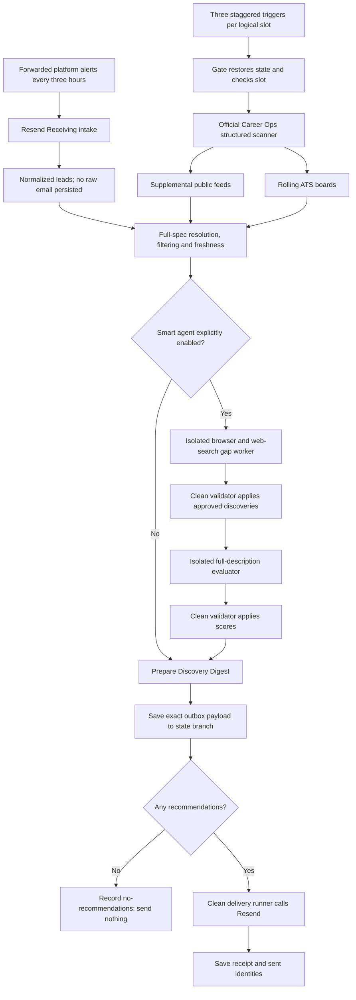

# Architecture

Career Intelligence is a one-person, private GitHub deployment installed inside Career Ops.

## Deterministic core

Career Ops `scan.mjs` runs first and remains the canonical structured scan. `src/sources.mjs` owns supplemental public-feed and ATS acquisition. `src/intake.mjs` normalizes the eight supported platform-alert families. `src/ranking.mjs` owns configurable role matching, location checks, hard-language rules, freshness, management signals and bounded live-page verification. `scripts/run-structured-scan.mjs` merges those deterministic lanes and writes candidate, coverage and state artifacts.

The core does not call a language model. It has a separate `should_run` signal from the optional model worker. Disabling `CAREER_OPS_AGENT_ENABLED` cannot disable the structured scan.

ATS directories are sharded. Saved cursors advance rolling Greenhouse, Lever, Ashby and Workday coverage over multiple runs. A source or company-board failure is isolated and recorded.

An alert is discovery evidence, not a job specification. LinkedIn, Indeed and Glassdoor leads are resolved employer/ATS-first; supported public boards may first expose a complete JobPosting page. An unresolved, expired or incomplete specification cannot enter automatic recommendation as if it had been evaluated.

## Career Ops boundary

Career Ops remains the home of the CV, narrative profile, portals, tailoring rules, application tracker and interactive workflow. Setup derives a smaller deterministic scan profile that the user reviews. The optional Smart worker reads Career Ops instructions and uses Career Ops history and fingerprints when it adds discoveries.

## Trusted and untrusted jobs

Codex or Claude Code runs only when both `digest.mode: smart` and the repository variable `CAREER_OPS_AGENT_ENABLED=true` are present.

Model jobs receive read-only repository permissions, no persisted Git credentials and no Resend secret. They return bounded schema-validated JSON. A fresh job applies that output. Email is prepared and sent from another clean runner.

## Durable delivery

Each logical morning or evening slot has one repository-scoped delivery key. The complete email payload is saved before Resend is called. A retry resumes that payload without scanning again. Delivered and zero-result slots are terminal. Every non-2xx Resend response remains an error unless a delivery receipt was already saved independently.

Runtime files are persisted to the dedicated `career-intelligence-state` branch through an explicit allowlist. The default branch remains code and reviewed configuration.

Alert intake, digest delivery and state restoration use one GitHub concurrency group. A separate weekly read-only maintenance workflow checks for compatible Career Ops and extension versions and asks for a guided update instead of mutating a live deployment unattended.
